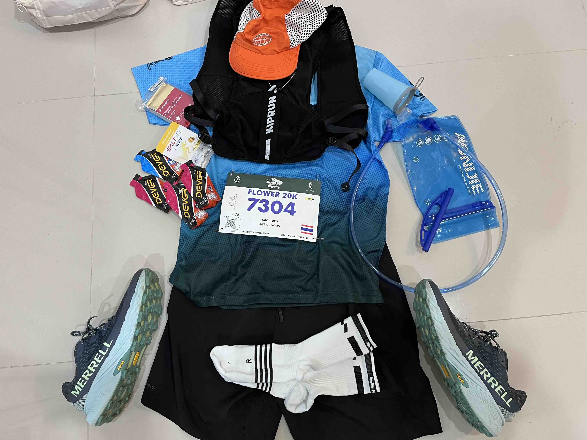
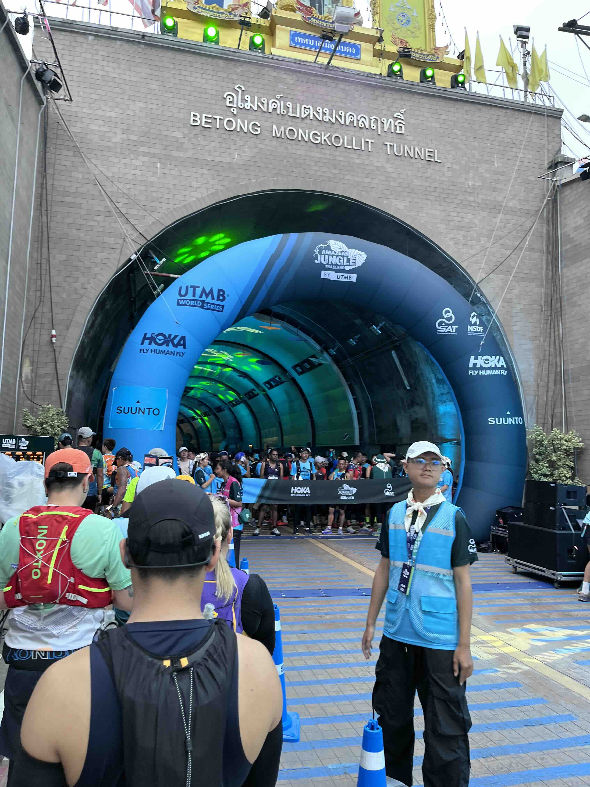
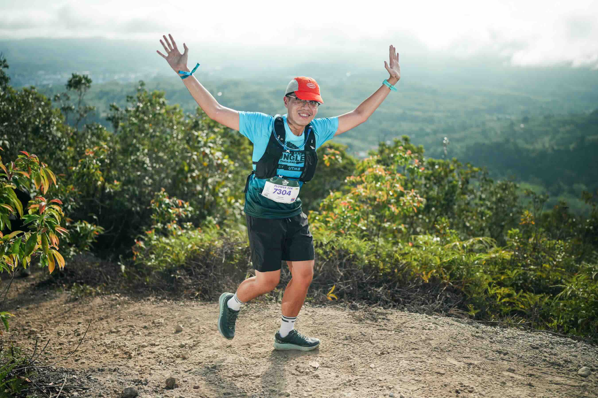
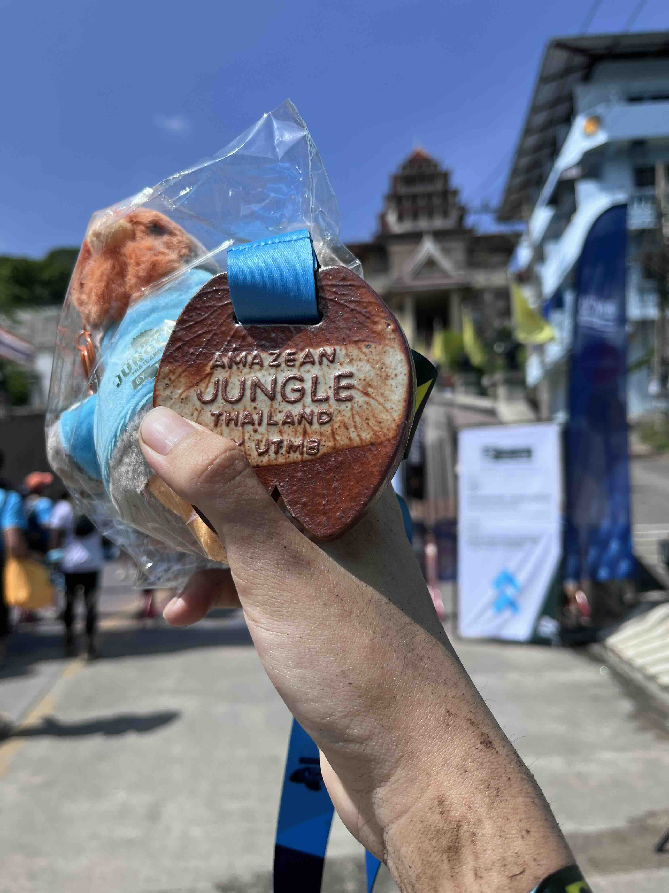

## Prologue
This race wasn't my first trail running race but this race was my first UTMB Index Race. There're many distances available
for this race e.g. Betong 100M, Tunnel 100K, Jungle 50K , Mist 20K, and lastly Flower 20K. I choosed 20K Flower because
it sounds doable for me whose experience is still limited. 20K Flower had a total distance of 17km with 400++ m elevation
(my Garmin measured almost 500m lol)

## Pre-race Days (1-2 May 2026)
I travelled with the guys from my office who also participated in this race. (Kudos to them, they finished 100k and 50k).
We had a flight from DMK to HDY and then rent a car which we drove to Betong; Southernmost of Thailand.
It took us 4 hours of driving to Betong. The first thing we ought to do is pick up our race kits and check our mandatory gear.
After all things were done. We strolled around Betong township and had dinner together at a local Betong-Chinese restaurant.
The food here is superb, e.g. Betong Chicken, Hakka-style Meatball soup. That was all for the first day at Betong.

Nothing much for the second day. I and remaining guys who didn't race 100k, 50k drove around vicinity of the town to aid our runners.
When we were done, I prepared my gears for the next day.

## Race Day (3 May 2026)
My start time was 7am. I arrived at Betong Mongkollit Tunnel around 6.30am. At that point, I had already done with carb-loading.
I did dynamic-stretching to warm up my muscles. Few minutes before 7am, I was very exciting while the clock was counting down.
At 7am, the horns were blown, signalling the start of my journey into the jungle.

The first 4km was all on the road with a small elevation. Then we arrived at the first checkpoint, I brought my foldable cup
to drink some electrolyte. For the next 10km, I was in the wild, the route is an uphill trail to Jarohkaga viewpoint,
most of elevation in this race was concentrated in this segment. This segment is the most tiresome in this entire race.
The breathtaking view at the top was worth all the uphill effort.

The next segment was easier, I ran along the ridge down into a rubber plantation. There were few unofficial aid stations provided by villagers.
Downhill running is enjoyable to me. I kept cruising speed down the hill. Finally I was out of the wild and back on the road.
There were many people cheering us on. At around 9am, it was hot, I sweated a lot. I tried to sip water from my bladder.
Around 30 minutes passed, My Garmin said total distance was 14km. I was so relieved. Just one more uphill and I would arrive back in the town.
I chewed a salt tablet and ate my last pack of energy gel to gather my strength for final push to the finish line.
I arrived at the finish line after 3 hours. I received a medal and a souvenir Betong chicken plushie.

## Conclusion
I couldn't believe I actually did it. This race was incredibly fulfilling. There will be next time for sure.
I'm going to do more weight training and increase my running mileage to prepare for even greater challenges.
