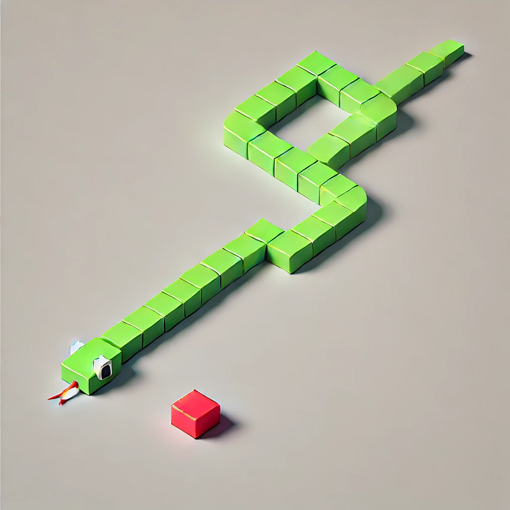

ปกติเวลาที่เราลองเล่น framework หรือ ภาษาใหม่ๆ การเขียนเกมส์แบบง่ายๆ ก็เป็นหนึ่งในตัวเลือกที่จะช่วยให้เราเข้าใจ
เครื่องมือต่างๆที่ framework หรือ ภาษานั้นๆมีให้ เป็นพื้นฐานในการเอาไปเครื่องมือเหล่านั้นไปใช้ต่อไป รวมทั้งเป็นการลับคม
logic ของเราให้ดีขึ้นด้วย วันนี้เราจะลองมาสร้างเกมส์งูด้วย Elm กัน

*Snake game's wallpaper generated by ChatGPT*

## Elm คืออะไร

Elm เป็นภาษาโปรแกรมภาษาหนึ่งที่ paradigm ของมันเป็น functional programming โดยปกติแล้วในภาษาอื่นๆ ที่เป็น imperative เวลาที่เราจะให้คอมพิวเตอร์ทำงานอะไร
สักอย่างเราจะต้องสั่งมันให้ทำหนึ่งทำสองไปเรื่อย แต่ใน functional programming ทุกอย่างเริ่มต้นด้วย pure function (ฟังก์ชันที่ไม่มี side effect
ยกตัวอย่างเช่นการกำหนดค่าให้ตัวแปรที่อยู่นอกฟังก์ชัน) เอามา compose กัน โค้ดในภาษา Elm จะถูก compile ให้เป็น JavaScript อีกทีหนึ่ง syntax ของ Elm
นั้นได้แรงบันดาลใจมาจาก Haskell ซึ่งเป็นเจ้าพ่อของภาษา functional programming เลยทีเดียว

### Elm Architecture

สถาปัตยกรรมของ Elm นั้นถูกออกแบบสำหรับการพัฒนา UI อันประกอบไปด้วย 3 หัวใจหลักได้แก่
  1. Model: เก็บ state ของแอพพลิเคชั่น
  2. View: การแสดงผลจาก state ใน model ไปเป็น HTML
  3. Update: การเปลี่ยนแปลง state ใน model จาก action ต่างๆ
