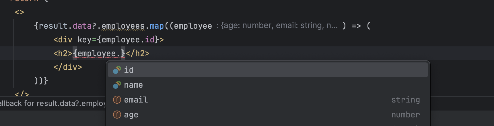

โดยปกติแล้วถ้าเราอยากให้ชีวิตของเราง่ายขึ้นในการใช้ GraphQL กับ TypeScript ก็จะต้องใช้พลังของ codegen (ที่ใช้ประจำมี [GraphQL Code Generator](https://the-guild.dev/graphql/codegen)) ในการ generate พวก type definition
จากไฟล์ GraphQL schema ให้ แต่การเพิ่ม codegen เข้ามาในโปรเจคก็อาจจะทำให้โปรเจคมีความซับซ้อนขึ้น และอาจจะทำให้เราต้องใช้เวลาเพิ่มขึ้นในการตั้งค่า
สิ่งต่าง ๆ หา preset ที่ถูกใจ

วันก่อนนั่งไถ feed ไปแล้วเจอ Matt Pocock เอา [gql-tada](https://gql-tada.0no.co/) มาสาธิตการใช้งาน ในที่สุดก็มีคนนำเวทมนต์ของ Typescript มาใช้กับ GraphQL แล้ว
ไม่มากความ มาเริ่มกันเลยดีกว่า

## Getting Started

เพื่อความง่าย เราใช้ vite ในการสร้างโปรเจค React ใหม่ได้เลย [อ่านเพิ่มเติม](https://vitejs.dev/guide/) จากนั้นเราก็ติดคั้ง dependency ที่เราจะใช้ได้เลย

```bash
  npm install gql.tada
  npm install --save-dev @0no-co/graphqlsp
  npm install urql graphql
```

หน้าตาของ schema.graphql  ที่เราจะใช้

```graphql
type Employee {
    id: Int!
    name: String!
    email: String!
    age: Int!
}

type Query {
    employees: [Employee!]
}
```

จากนั้นเราก็มาเติม plugin ลง tsconfig

```json
{
  "compilerOptions": {
    "strict": true,
    "plugins": [
      {
        "name": "@0no-co/graphqlsp",
        "schema": "./schema.graphql",
        "tadaOutputLocation": "./src/graphql-env.d.ts"
      }
    ]
  }
}
```

สักพัก code editor ของเราก็จะ generate ไฟล์ graphql-env.d.ts ขึ้นมาให้เรา และเราก็สามารถใช้ type ที่ถูก generate มาในการใช้งานได้เลย
ข้างล่างเป็นตัวอย่างการใช้งาน เราจะเพียงแค่เอา query string มายัดลงฟังก์ชัน graphql ของ gql.tada มาใช้กับ urql ได้เลย หรือถ้าเราใช้ Apollo
ก็สามารถใช้ได้เช่นกัน

```tsx
import './App.css'
import {graphql} from "gql.tada";
import {useQuery} from "urql";

const EmployeesQuery = graphql(`
    query EmployeesQuery {
        employees {
            id
            name
            salary
        }
    }
`);

function App() {
   const [result] = useQuery({query: EmployeesQuery})

   return (
    <>
        {result.data?.employees.map((employee) => (
            <div key={employee.id}>
            <h2>{employee.name}</h2>
            </div>
        ))}
    </>
  )
}

export default App
```

เราก็จะได้ auto-completion และ type safety ในการใช้งาน GraphQL ได้เลย โดยไม่ต้องใช้ codegen ในการ generate type มาใช้งาน


