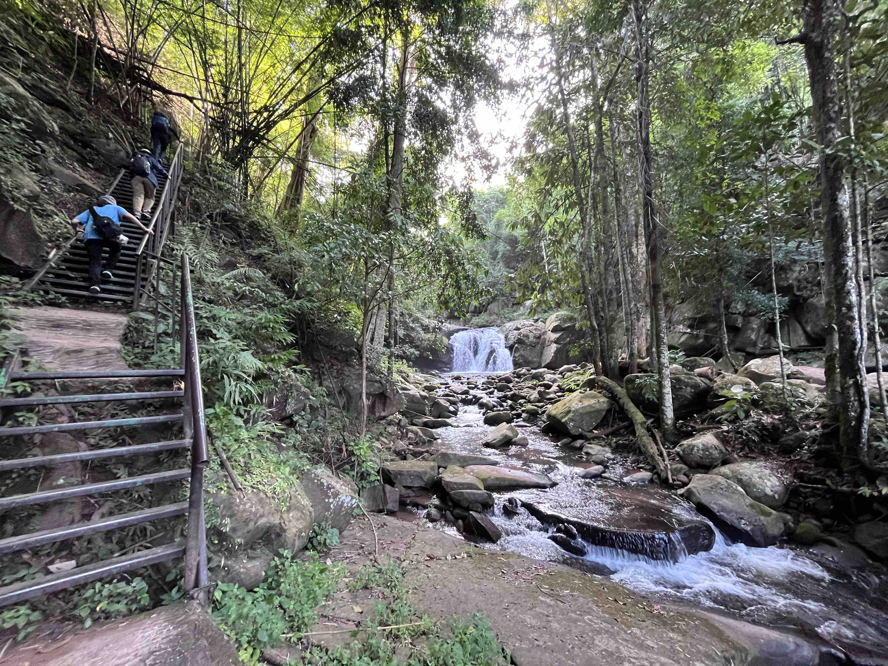
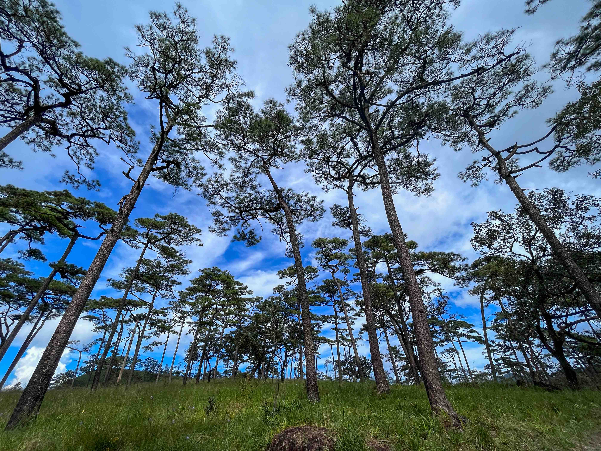

## เกริ่นนำ

การเดินเขาครั้งแรกนี้นับเป็นครั้งแรกในชีวิตของผม ก่อนหน้านี้อาจจะมีไปเที่ยวแบบนอนกลางเต้นท์ตามอุทยานกับที่บ้านบ้าง แต่ไม่เคยเดินเขาแบบที่เป็นเส้นทางไกลๆ
สองสามวันก่อนการเดินทางมีความรู้สึกกังวลนิดหน่อย ความกลัวในสิ่งที่ไม่รู้จักน่าจะเป็นหนึ่งในธรรมชาติของมนุษย์เรากระมัง แต่เมื่อถึงเวลาเราก็ต้องออกเดินทาง
คิดในใจว่าจุดหมายปลายทางต้องมีอะไรๆ ที่มหัศจรรย์รอการค้นพบอยู่เป็นแน่

ภูสอยดาว หรือที่เรียกชื่อเต็มๆว่า "อุทยานแห่งชาติภูสอยดาว" ตั้งอยู่ที่ชายขอบของจังหวัดพิษณุโลก และจังหวัดอุตรดิตถ์ ค่อนไปทางชายแดนของประเทศลาว นั่งรถจากกรุงเทพ
ใช้เวลาค่อนข้างหลายชั่วโมงเลยทีเดียว ออกจากกรุงเทพประมาณสามทุ่มกว่า ถึงโน้นก็เกือบหกโมง ฟ้าจะสว่างแล้ว อากาศค่อนข้างเย็น ตามแบบของช่วงปลายฝนต้นหนาว
เราจัดแจงกินข้าวเช้า ล้างหน้า แปรงฟัน แล้วยืดเส้นยืดสายนิดหน่อยพร้อมกับการผจญภัยวันนี้ที่ได้เริ่มต้นขึ้นแล้ว

## การเดินทาง

เราเริิ่มออกเดินทางจากที่ทำการอุทยานประมาณเวลา 8 โมงเช้า โดยจะมีรถกระบะมารับเราจากที่ทำการอุทยานขึ้นไปตรงน้ำตกภูสอยดาว ซึ่งจะเป็นจุดที่เราเริ่มออกเดิน
เป้าหมายของเราคือลานสนที่สูงจากระดับน้ำทะเลเกือบ 1600 เมตร ซึ่งมีระยะทางรวมกว่า 6.5 กิโลเมตร น่าจะต้องใช้เวลาเกือบค่อนวันในการเดินทาง

ที่ตรงทางเข้านั้นจะมีร้านขายของกับป้อมเล็กๆ สำหรับเก็บค่าผ่านทาง ประตูที่เราจะเดินเข้าไปจะอยู่ที่ซ้ายมือ และมีด้านขวามือสุดเป็นนำ้ตก เส้นทางเราเดินนั้นจะเป็นทางที่ถูกแผ้วถาง
ให้คดเคี้ยวไปกับโกรกธาร อากาศค่อนข่องข้างชื้น แสงอาทิตย์ทำได้เพียงเล็ดลอดตามยอดไม้มารำไร ก้อนหินส่วนใหญ่แฉะ และปกคลุมไปด้วยมอส ทำให้เราต้องระมัดระวังในการเดิน
เนื่องจากเป็นการเดินเขาครั้งแรกของเราอุปกรณ์ไม่ได้พร้อมเพรียงมากขนาดนั้น เราจึงต้องหาไม้ที่ตกอยู่แถวนั้นไม่ใช้ไปอุปกรณ์ช่วยค้ำยันตัวเราเวลาเดิน โชคดีว่าเจอไม้วางไว้แถวนั้น
พอดี ไม้อันนั้นจะเป็นผู้ช่วยที่ซื่อสัตย์ของเราจนจบทริป เส้นทางมีขึ้นมีลงเป็นคลื่นๆ ตรงไหนที่ชันมากจะมีบันไดเหล็กสำหรับปีนขึ้น จนถึงช่วงท้ายของตีนเขา เราจะเริ่มพบกับความลาดชัน
ของเนินส่งญาติ คนตั้งชื่อก็เข้าใจคิดเพราะสิ่งที่เราจะเจอต่อไปนี้จะโหดหินกว่านี้เยอะแค่นี้คือเหมือนแค่ญาติเดินมาส่ง ถัดจากตรงนี้เส้นทางเริ่มจะเป็นหินก้อนใหญ่ๆ วางซ้อนทับกันเป็นชั้นๆ
เริ่มใช้แรงมากขึ้นในการยกตนเองขึ้นไป ได้ยินมาจากคนที่เดินลงสวนมาว่าข้างหน้านี้คือเนินปราบเซียน เรารู้สึกเหมือนเดินขึ้นมาได้เยอะแล้วแต่พบว่ายังมีทางชันขึ้นไปอีก
พอเหนื่อยๆ เหล่ากลุ่มนักเดินทางก็นั่งพักตามโขดหินหรือแคร่ที่ถูกตั้งไว้เป็นระยะ ทุกคนต่างหยิบน้ำเปล่ามาดื่มชดเชยกับสิ่งที่สูญเสียไป พักเพียงชัวครู่ก็เดินกันต่อไป

เส้นทางเริ่มหมดความชันหลังผ่านพันเนินปราบเซียนไป ตอนนี้ถ้ามองไปข้างล่างเราจะพบเราอยู่ขึ้นมาสูงระดับหนึ่งแล้วน่าจะ 600-700 เมตรจากระดับน้ำทะเล
เราจะต้องเดินอยู่บนสันเขาไปอีกสักพักใหญ่ๆ ระหว่างทางจะเห็นลูกหาบเดินตามขึ้นมา การแบกของหลายสิบกิโลขึ้นเขาน่าจะต้องใช้พละกำลังรวมทั้งความอดทนเป็นอย่างมาก
กลับมาที่ตัวเราซึ่งแบกของมาหน่อยเดียวกลับรู้สึกอ่อนล้าเป็นอย่างมาก เดินมาครึ่งทางมีแคร่ไม้ไผ่วางไว้หลายอันเป็นสัญญาณบ่งบอกถึงการพักเที่ยง เติมพลังด้วยแท่งธัญพืชอบกรอบ
และน้ำเปล่า พอให้มีแรงเดินต่อไป การเดินเหงื่อท่วมตัวเป็นอะไรที่ล่อเหล่าแมลงได้เป็นอย่างดีทั้งผึ้งหรือยุง ต้องคอยทายา หลังจากจุดพักเราจะมาถึงเนินเสือโคร่ง
ซึ่งก็ไม่ได้ยากมากแต่ว่ามันทางลาดที่ค่อนข้างยาวถ้าเกร็งเกินไปอาจเป็นตะคริวได้ เนินนี้ยังพอเดินได้เรื่อยๆ ผ่านมาแล้วเกือบครึ่งวัน เรามาถึงเนินที่ว่ากันว่ายากที่สุดของทั้งเส้นทางนี้
นั่นคือเนินมรณะ มองจากข้างล่างจะเห็นเหมือนว่าเนินนี้เป็นกำแพงสีเขียวขนาดยักษ์ที่กั้นเราจากลานสน

เส้นทางของเนินนี้จะเป็นคล้ายทางน้ำไหลเต็มไปด้วยหินก้อนใหญ่ที่พอจะมีขั้นให้เราเหยียบบ้าง บางขั้นต้องใช้ทั้งสองมือในการตะกายขึ้นไป นอกจากความชันอันสาหัสแล้ว
เนินนี้จะไม่มีร่มไม้ให้เราหลบอีกแล้ว แต่โชคดีที่ช่วงที่เราไปเป็นปลายฝนต้นหนาวยังพอมีก้อนเมฆมาบังแดดได้บ้าง
ตอนระหว่างปีนขึ้นก็มีการพักเหนื่อยหันกลับมามองทัศนียภาพข้างหลังบ้างเพราะมันช่างคุ้มค่ากับความเหนื่อยในการปีนขึ้นมามากเพียงไหน เมื่อขึ้นมาถึงจุดนึงจะมีทางแยกซ้ายขวา
โชคดีที่มีพี่ที่เดินสวนมาบอกว่าทางขวาจะเดินสบายกว่า เราก็ตามนั้นเลือกเส้นทางที่สบายที่สุด เส้นทางจะคล้ายกับการเดินอ้อมเนินอาจจะไกลนิดนึงแต่ไม่ชันมาก สองฝั่งของทางดิน
เต็มไปด้วยต้นเฟิร์น ทำให้สถานที่แห่งนี้น่าฉงนมากเหมือนหลุดเข้าไปในป่าดึกดำบรรพ์ นอกจากนี้ยังซากตอไม้ที่เหมือนโดนฟ้าผ่าอยู่ทั่วไป อาจมีโอกาสสะดุดรากไม้บ้างต้องค่อยๆเดิน

และแล้วความพยายามตลอด 6-7 ชั่วโมงก็สัมฤทธิ์ผล เรามาถึง ณ ลานสนแล้ว เป็นสถานที่ดูน่าแปลกตามาก มีต้นสนประปรายไปกับทุงหญ้าสุดลูกหูลูกตา ค่อนข้างแปลกใจเลยที่เดียว
ที่ภูเขาสูงจะมีสถานที่แบบนี้ซ่อนอยู่ได้ และเนื่องจากเป็นช่วงปลายฝนต้นหนาวทำให้เรายังเจอดอกหงอนนาคอยู่แซมๆตามทุ่งหญ้าบ้างละเลงวิวทิวทัศน์ที่เต็มไปด้วยสีเขียวให้มีจุดสีม่วงๆ
เพิ่มความน่าจดจำให้วิวทิวทัศน์ไปอีกขั้นหนึ่ง ดื่มด่ำกับความมหัศจรรย์ของธรรมชาติมากพอควรแล้ว ได้เวลาเดินไปที่ลานกางเต้นท์ เริ่มมีคนมาถึงพอสมควรแล้ว เราจัดแจงเก็บของลงเต้นท์
รีบไปอาบน้ำก่อนตะวันตกดินเพราะน้ำจะเย็นมาก ที่นี้การอาบน้ำเราจะต้องเอาถังไปรองนำ้แล้วยกเข้าไปตักขันอาบเอา ขนาดบ่ายแก่ๆน้ำยังเย็นมาก แต่ก็ทำให้สดชื่นได้ดีมากหลังสูญเสียเหงื่อมาค่อนวัน
หลังจากอาบน้ำเสร็จเราก็เดินสำรวจดูรอบๆลานสนพบว่าถ้าเดินต่อข้างหลังจะมีทางเดินไปดูหลักเขตแดนไทย-ลาว และที่บริเวณข้างหลังนี้เราจะเห็นยอดภูสอยดาวที่สูงประมาณ 2100 เมตร
บนยอดมีเมฆปกคลุมอยู่ บนยอดนั้นเราสามารถไปพิชิตได้เหมือนกันแต่ต้องมีเจ้าหน้าที่ไปด้วย รวมทั้งต้องไต่เชือกขึ้นไป แต่ครั้งนี้เราขอแค่พิชิตลานสนพอ เดินเล่นวนตามเส้นทางนั้นสักพักใหญ่ๆ
เราก็มาดูวิวพระอาทิตย์ตกดิน ถ่ายภาพเก็บความมรงจำเล็กน้อย แล้วก็กลับมาที่ลานกางเต้นท์ พอมืดแล้วก็มากินข้าวกัน กินข้าวเสร็จฟ้ามืืดแล้วก็เดินออกไปดูดาว
วันนี้เป็นคืนเดือนมืดเลยเห็นดาวอยู่เต็มท้องฟ้าเลย น่าจะเป็นครั้งแรกในชีวิตที่เคยเห็นดาวเยอะขนาดนี้ อิจฉาเหล่าคนที่ไม่โดนคำสาปอันของสิ่งที่เรียกว่าเมืองใหญ่ที่ที่แสงสว่างจอมปลอมกลบแสงดาวจนหมดสิ้น
ดูดาวอยู่ครู่เริ่มหนาวเลยกลับเข้าเต้นท์ไปนอนพักผ่อนเป็นอันสิ้นสุดวันหนึ่งที่ดีที่สุดในปีนี้เลย

เช้าแล้วได้เวลาเดินลง ขาลงอาจไม่เหนื่อยเท่าขาขึ้นแต่ต้องคอยเบรกไม่ให้เราไถล ต้องคอยย่อขาเพื่อให้ขาไม่เกร็งเกิน มิงั้นอาจเป็นตะคริวได้ การเดินลงนี้ใช้เวลาไม่มาก
แปปเดียวเราก็มาถึงที่ทำการได้แล้ว ที่นี่จะมีร้านขายของและร้านอาหารเล็กๆ สำหรับเราจะไปอาบน้ำและเปลี่ยนเสื้อผ้า แล้วนั่งรถกลับกรุงเทพ เป็นอันสิ้นสุดการเดินทางครั้งแรกของเรา
ครั้งหน้าไปเที่ยวที่ไหนกันดีนะ

## บทเรียน

- ถ้าเหนื่อยแล้ว ลองก้าวหน้าอีกสักนิด คิดแบบนี้ไปเรื่อยๆ จะถึงจุดหมายเอง
- ครั้งหน้าถ้าไปแบบนี้ต้องลงทุนกับอุปกรณ์หน่อย ครั้งนี้กลับมาขาเจ็บมาก
- ของบางอย่างถ้าเราไม่ลองทำจริงๆ เราไม่มีทางรู้เลยว่าชอบหรือไม่ชอบ
