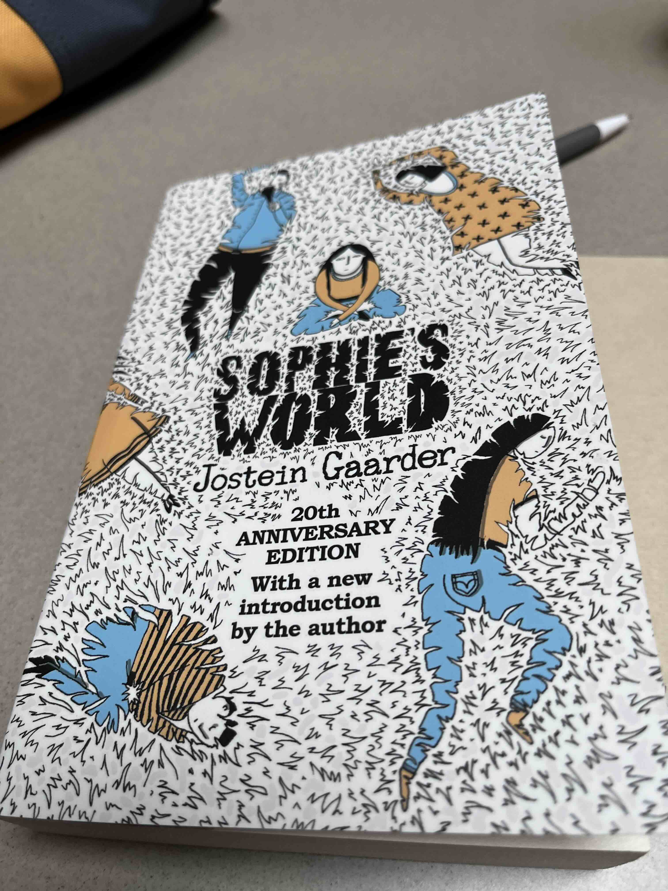

“Who am I?” What was the last time you asked this question to yourself ? This is the first question asked by Sophie.
In my opinion, this is the most important question which mankind has ever asked. Curiosity about oneself is the origin of many questions
e.g. What is everything made of ?, What is the origin of our world ? Well, many questions have been addressed by modern science already.
But in the past, it was a different matter, in order to answer them, philosophers of the past use only reasoning and observation
without any help from modern instruments. Many ideas from them still resonate well with the current state of our world.
I’m quite fascinated how they came up with such breakthrough ideas given their circumstances.

This book by Jostein Gaarder will embark you on a journey into history of philosophy (mainly the western one) from pre-socratic philosophers to Sartre.
You can think of this book as a crash course into philosophy with simplified explanations driven by a story which Sophie takes lessons from
her mysterious mentor, Alberto. The story began with a letter in Sophie’s mailbox. That letter contains big questions: “Who are you?”, “Where does this world come from?”.
Throughout the book, Alberto explored these questions in both rationalist and empiricist view. Rationalism and empiricism are a simple dichotomous way to divide philosophers.
A rationalist believes that knowledge stems from reasons only. On the contrary, an empiricist believes that knowledge is originated from senses.

In our lifetimes, with the introduction of artificial intelligence, the attention economy, social networks, etc.
I think that we ought to question more to maintain our humanity. Our thoughts are shaped by social network algorithms increasingly.
Social networks tend to serve us whatever is likely to attract our attentions most.
Algorithms can guess our opinions and will serve us only what aligned with ours.
If we don't reflect on our thoughts regularly, we tend to accept them undoubtedly. When this happens on a societal scale, the outcome is an echo chamber.
So what’s left for us human beings. It’s a right time to step out of Plato’s cave.

To make the most out of this book, I recommend reading it alongside a notebook. After finishing each chapter, feel free to write out that philosopher's argument
in your own words and then write your response.

Without wonder, we’re nothing more than hollow shells. As Socrates quoted it two thousand years ago “The unexamined life is not worth living”.

*Sophie's World - Jostein Gaarder*
