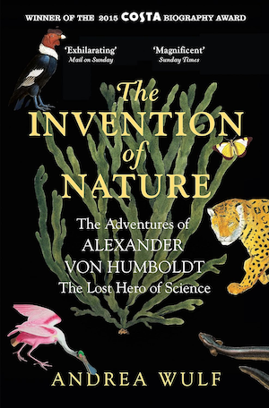

Last year, I bought this book when it's discounted on Kindle store. I had no idea how much this book was going to shape the way I look at Mother Nature.
This book merely is a biography book concerning the life of Alexander Von Humboldt written by Andrea Wulf. Although his name isn't famous as Charles Darwin,
his legacy still lives on. Humboldt was indeed the one who inspired Darwin to embark on his renowned journey on HMS Beagle
and came back with a blueprint for the theory of evolution. There're many places in South America named after him. One of his idea called "Naturgemälde"
still resonates in my mind.

"Naturgemälde" or "picture of nature" is a profound idea conceptualized after his ascent of mount Chimborazo. It represents interconnectedness of nature,
floras and faunas are shaped by their ecosystems as much as who we are. There's a sense of Wonder behind his view of nature.
Unlike his counterparts, he didn't just measure nature, he experienced it. His expedition to South America was astonishing on its own right. Yet what matters most is
his poetic narrative of scientific observation, which influenced other naturalists such as Darwin, John Muir, and even poets such as Goethe.

From now on, this book has changed the way I look at nature. A beautiful mountain scenery isn't just a backdrop anymore. It's a part of us and vice versa.
One day, every atoms in our bodies will return to Mother Nature.  What a waste it would be if we never took the time to appreciate her while we still can.

Let me end this blog with a quote from the book.

> Of course nature had to be measured and analysed, but he also believed that a great part of our response to the natural world should be based on the senses and emotions.

*The Invention of Nature by Andrea Wulf*
