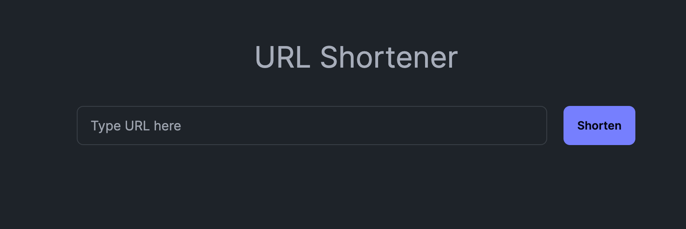
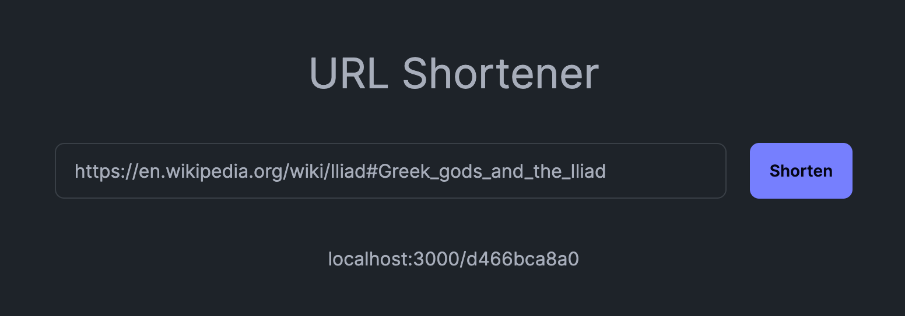

หลังจากที่ NextJS ได้ปล่อย App Router ให้เรามาลองใช้กันใน Next 13 เจ้าตัว App Router ก็ให้ของเล่น
อย่าง Server Action ให้เราใช้งานได้ ซึ่งการใช้งาน Server Action นี้ทำให้หลายคนคิดถึง PHP ขึ้นมาทันทีเลย
เกิดเป็นกระแสทำเป็น meme ต่างๆนานามากมาย แต่ใเมื่อมีของให้ใช้เราก็ลองหยิบมันมาเล่นหน่อย
ในบล๊อกนี้เราจะมาสร้างเว็บย่อลิงก์ (URL Shortener) ด้วย NextJS และ Server Action กัน

## สร้างโปรเจค NextJS

ส่วนนี้ไม่มีอะไร แค่สร้าง project ใหม่ด้วย `create-next-app` ก็เป็นอันเรียบร้อยแล้ว

```bash
npx create-next-app@latest
```

เลือกตั้งค่าได้ตามใจชอบ หลักๆขอให้เลือกเป็น App Router นะ ไม่ต้อง Pages Router เราจะได้ใช้ server action ได้

## เตรียม UI

เตียม input UI ให้พร้อมในที่นี้เราจะใช้ Tailwind + DaisyUI ในการปั้น component แบบไวๆ

```tsx
export default async function Home() {
  return (
    <main className="flex min-h-screen flex-col items-center p-24">
      <h1 className="text-4xl mb-10">URL Shortener</h1>
      <form className="flex flex-row justify-center w-full gap-5">
        <input
          name="url"
          type="text"
          placeholder="Type URL here"
          className="input input-bordered w-full max-w-xl"
        />
        <button type="submit" className="btn btn-primary">Shorten</button>
      </form>
    </main>
  );
}
```

เป็น UI หน้าตาง่ายๆ ที่มี text input กับปุ่ม Shorten



## สร้าง Server Action

อย่าลืมติดตั้ง Redis client ให้เรียบร้อยก่อนใช้งานนะ ตัว server ใช้รันจาก Docker เอา
ครั้งนี้ที่หยิบเอา Redis มาใช้เก็บข้อมูล

ขั้นแรกเราสร้างไฟล์ Typescript ใหม่ขึ้นมาอันนึงตั้งชื่อว่า `actions.ts` แล้วเขียนโค้ดด้านล่างนี้ลงไป

```ts
"use server";

import { createClient } from "redis";
import { randomBytes } from "crypto";

export async function shorten(formData: FormData) {
  const url = formData.get("url");

  if (!url || typeof url !== "string") {
	throw new Error("Invalid URL");
  }

  const client = createClient();
  await client.connect();

  const key = randomBytes(5).toString("hex")
  await client.set(key, url);

  const value = await client.get(key);
  console.log('saved url:', value);
}
```

โค้ดข้างบนนี้เป็นโค้ดที่ใช้ในการย่อลิงก์ URL โดยการสร้าง key แบบสุ่ม 5 ตัวอักษรแล้วเก็บ URL ลงใน Redis
เราใช้ `createClient` ในการเชื่อมต่อกับ Redis และใช้ `randomBytes` ในการสร้าง key สุ่ม 5 ตัวอักษร

จากนั้นเราลองไปแก้โค้ด ui นิดนึงให้เรียกใช้ server action ที่เราสร้างขึ้นมา

```tsx
import { shorten } from "./actions";

export default function Home() {
  return (
    <main className="flex min-h-screen flex-col items-center p-24">
      <h1 className="text-4xl mb-10">URL Shortener</h1>
      <form action={shorten} className="flex flex-row justify-center w-full gap-5">
        <input
          name="url"
          type="text"
          placeholder="Type URL here"
          className="input input-bordered w-full max-w-xl"
        />
        <button type="submit" className="btn btn-primary">Shorten</button>
      </form>
    </main>
  );
}
```

หลักๆ เราจะสามารถ import function shorten มาใช้บน client side ได้แบบง่ายๆเลย ไม่ต้องทำ API Route แบบ Next เวอร์ชันก่อนๆ
อย่าลืมใส่ name ให้ text input ด้วย

เมื่อทุกอย่างพร้อมแล้ว เราทดลองใส่ URL ลงไปแล้วกดปุ่ม Shorten ดู เราจะ log ข้อความ `saved url: <url>` ออกมาบน terminal แปลว่า
ีurl ที่เราพิมพ์ลงไปถูกเก็บลงใน Redis สำเร็จแล้ว เราเอา url ที่ได้มาแสดงผลบน ui กันดีกว่า

## การใช้งาน useFormState กับ Server Action

เราจะใช้ hook ที่ชื่อ useFormState ของ React ในการเอาผลลัพธ์จาก server action มาแสดงผลบน UI กัน
แต่ก่อนที่เราจะไปปรับโค้ดของตัว UI เรามาปรับโค้ดของ server action ให้ส่งค่ากลับมาได้ก่อน ตามนี้

```ts
export async function shorten(
  currentState: { url: string }, // Add this line
  formData: FormData
) {
  const url = formData.get("url");

  if (!url || typeof url !== "string") {
    throw new Error("Invalid URL");
  }

  const client = createClient();
  await client.connect();

  const key = randomBytes(5).toString("hex");
  await client.set(key, url);

  return { url: `localhost:3000/${key}` }; // Add this line
}
```

เราเพิ่ม parameter ใหม่เข้าไปใน function shorten คือ currentState ความจริงจะเป็น type ไหนก็ได้หลักๆ ค่าที่ return ของฟังก์ชันนี้
ต้องเป็น type เดียวกัน ในที่นี้เราจะคืนค่ากลับมาเป็น object ที่มี key ชื่อ url และมีค่าเป็น URL ที่เราย่อลิงก์ไว้ ตัว base URL เราจะ hardcode ไว้ก่อน
เพื่อความไว

กลับมาที่ client side เราจะใช้ hook ที่ชื่อ useFormState ในการเอาค่าที่ server ส่งกลับมาแสดงผลบน UI ตามนี้

```tsx
"use client";
// อย่าลืมแปะ "use client" ไม่งั้นเวลาใช้ useFormState จะ error

export default function Home() {
  const [state, formAction] = useFormState(shorten, {url: ""}); // ใช้ useFormState ในการเอาค่าจาก server action มาใช้

  return (
    <main className="flex min-h-screen flex-col items-center p-24">
      <h1 className="text-4xl mb-10">URL Shortener</h1>
      <form
        action={formAction}
        className="flex flex-row justify-center w-full gap-5"
      >
        <input
          name="url"
          type="text"
          placeholder="Type URL here"
          className="input input-bordered w-full max-w-xl"
        />
        <button type="submit" className="btn btn-primary">
          Shorten
        </button>
      </form>
      {/*แสดง url ที่ได้คืนมาจาก server action*/}
      {state.url && <p className="mt-10">{state.url}</p>}
    </main>
  );
}
```

ถ้าเรา submit แล้วเราจะเห็น URL ที่เราย่อลิงก์ไว้แสดงออกมาบนหน้าเว็บ



## ทำ Route สำหรับ Redirect URL

ตอนนี้เรามีทุกอย่างเกือบครบแล้ว แต่เรายังไม่มี route สำหรับ redirect URL ที่เราย่อลิงก์ไว้ ในที่นี้เราจะสร้าง route ใหม่
ให้สร้างไฟล์ `/[key]/route.ts` ตัวนี้คือ Route Handler หรือก็เหมือน API Route ใน Pages Router นั่นเอง

```ts
import { redirect } from "next/navigation";
import { createClient } from "redis";

export async function GET(
  request: Request,
  { params }: { params: { key: string } }
) {
  const { key } = params;

  const client = createClient();

  await client.connect();

  const url = await client.get(key);

  if(!url) {
    console.log("URL not found");
    return redirect("/");
  }

  return redirect(url);
}
```

ในตัว Route Handler เราสามารถตั้งชื่อ function ได้ตาม HTTP Method เลย เช่น GET, POST, PUT, DELETE ในที่นี้เราใช้ GET
เพราะเรามีแค่อ่านข้อมูลอย่างเดียว เริ่มที่ input ของฟังก์ชันจะมีการดึงค่า key จาก path params แล้วเอา key นั้นไปใช้ในการดึง URL จาก Redis
ก่อนที่จะใช้ `redirect` ในการเปลี่ยนเส้นทางไปยัง URL ที่เราย่อลิงก์ไว้ เป็นอันเสร็จสิ้น ถ้าไม่เจอก็จะ redirect กลับไปหน้าแรก กับพ่น error ออกมา

## สรุป

App Router + Server Action จะช่วยให้เราขึ้นงานได้ไวมาก แต่ว่าระหว่างทางก็อาจเจอ error ที่ของบางอย่างอาจใช้บน Server Component ไม่ได้
ให้ใช้แค่ใน Client อย่างเดียว ความจริง Server Action ยังเหลือรายละเอียดอื่นๆอีกเช่นการใช้ `useFormStatus` เพื่อแสดงสถานะ pending ให้ UI
สามรถศึกษาเพิ่มเติมได้ [documentation](https://nextjs.org/docs) เลย
สำหรับวันนี้ก็ขอบคุณที่มาอ่านบล๊อกนี้นะครับ

> Happy coding!
